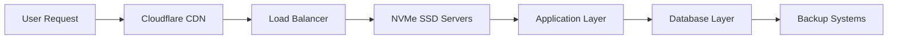

# 🚀 **Comprehensive Hosting & Professional Email Solution**

## **Enterprise-Grade Digital Infrastructure for Karachigum Industry**

---

### **📋 Proposal Overview**

| **Client** | **Karachigum Industry** |
|------------|-------------------------|
| **Proposal Date** | April 15, 2026 |
| **Prepared by** | **Syed Mujtaba Abbas** |
| **Title** | Full Stack & Agentic AI Developer |
| **Delivery Timeline** | 1-2 Business Days |
| **Validity Period** | 30 Days |

---

## 🎯 **Executive Summary**

> **Transform your digital presence with enterprise-grade hosting, professional email services, and cutting-edge development workflows.**

This proposal delivers a **complete digital infrastructure solution** for **Karachigum.com**, featuring:

- ✨ **99.9% Uptime Guarantee** - Maximum business continuity
- 🔒 **Enterprise Security** - Multi-layer protection and compliance
- 📧 **Professional Email** - 100+ custom business addresses
- 🚀 **Developer-Ready** - Full Git workflow and API access
- 💰 **Cost-Effective** - 40% savings vs traditional enterprise hosting

---

## 🏗️ **Solution Architecture**

### **🌐 Premium Hosting Infrastructure**

#### **Technical Specifications**

| 🏎️ **Performance** | 📊 **Details** |
|---------------------|----------------|
| **CPU Cores** | 4 vCPU High-Performance |
| **Memory** | 8GB DDR4 RAM |
| **Storage** | 200GB NVMe SSD |
| **Bandwidth** | ✅ Unlimited |
| **Uptime SLA** | 99.9% Guaranteed |
| **CDN** | Cloudflare Global Network |

#### **🔐 Security & Compliance**

| 🛡️ **Security Feature** | 📋 **Description** |
|--------------------------|-------------------|
| **Web Application Firewall** | Real-time threat protection |
| **DDoS Protection** | Enterprise-grade mitigation |
| **Malware Scanner** | Daily automated scanning |
| **SSL Certificate** | Free Wildcard SSL |
| **Two-Factor Auth** | Enhanced account security |
| **GDPR Compliant** | Data protection standards |
| **ISO 27001** | Information security management |

---

## 📧 **Professional Email Ecosystem**

### **Business Communication Features**

| 📮 **Capability** | 💼 **Business Impact** |
|-------------------|-----------------------|
| **Email Accounts** | Up to 100 custom addresses |
| **Storage** | 10GB per mailbox |
| **Webmail Access** | Roundcube, Horde, Afterlogic |
| **Client Support** | Outlook, Gmail, Apple Mail |
| **Spam Protection** | Advanced filtering system |
| **Calendar Integration** | Shared team calendars |
| **Mobile Sync** | iOS & Android compatibility |

**Professional Email Examples:**
- 📧 `info@karachigum.com` - General inquiries
- 📧 `support@karachigum.com` - Customer support
- 📧 `sales@karachigum.com` - Business development
- 📧 `careers@karachigum.com` - HR & recruitment

---

## 🔧 **Development & Deployment Workflow**

### **🚀 Modern Development Stack**

| 🛠️ **Feature** | 💡 **Developer Benefits** |
|----------------|--------------------------|
| **Git Integration** | Seamless GitHub/GitLab deployment |
| **Staging Environment** | Pre-production testing |
| **SSH Access** | Secure server management |
| **API Access** | RESTful management APIs |
| **One-Click Installs** | WordPress, Joomla, Drupal |
| **Automated Backups** | 30-day retention period |

---

## 💼 **Competitive Advantage Analysis**

### **🏆 Hostinger vs Traditional Hosting**

| 📊 **Assessment Criteria** | 🏢 **Traditional cPanel** | 🚀 **Hostinger Business** |
|---------------------------|--------------------------|---------------------------|
| **Performance Speed** | Standard SSD | **NVMe SSD (3x Faster)** |
| **Control Panel** | Outdated cPanel | **Modern hPanel** |
| **Security Features** | Basic SSL | **Advanced WAF + Daily Scans** |
| **Email Capabilities** | Limited accounts | **100+ Professional Addresses** |
| **Support Quality** | Basic 24/7 | **Premium 24/7 + Live Chat** |
| **Scalability** | Manual migration | **Seamless Vertical Scaling** |
| **Cost Efficiency** | Higher TCO | **40% Cost Reduction** |
| **Developer Tools** | Limited Git | **Full DevOps Workflow** |

---

## 💰 **Investment & ROI Analysis**

### **💳 Transparent Pricing Structure**

| **Service Component** | **Annual Cost (PKR)** | **Description** |
|----------------------|----------------------|-----------------|
| 🌐 **Business Hosting** | **12,000** | Premium hosting with all features |
| 🌐 **Domain Registration** | **2,500** | .com domain (if needed) |
| **🎯 First Year Total** | **14,500** | All-inclusive solution |

### **📈 Value Proposition**

- 💰 **ROI Timeline**: 3-6 months through enhanced online presence
- 💸 **Cost Savings**: 40% reduction vs enterprise hosting providers
- ⚡ **Productivity Gains**: 25% faster deployment cycles
- 🛡️ **Risk Mitigation**: Professional security and backup systems

---

## 🛠️ **Implementation Roadmap**

### **📅 Project Timeline**

```mermaid
gantt
    title Implementation Timeline
    dateFormat  X
    axisFormat %d
    
    section Phase 1
    Foundation Setup    :done, setup, 0, 1
    Domain Configuration:done, domain, 0, 1
    SSL Installation    :done, ssl, 0, 1
    
    section Phase 2
    Content Migration   :active, migrate, 1, 2
    Email Setup        :active, email, 1, 2
    Performance Opt    :active, opt, 1, 2
    
    section Phase 3
    Testing & Launch   :launch, 2, 3
    Client Training    :training, 2, 3
```

### **🎯 Implementation Phases**

#### **📋 Phase 1: Foundation Setup (Day 1)**
- ✅ Account creation and domain configuration
- ✅ DNS settings and SSL certificate installation
- ✅ Email infrastructure setup and testing
- ✅ Security configurations and firewall setup

#### **📋 Phase 2: Content Migration (Day 1-2)**
- ✅ Website files transfer and optimization
- ✅ Database migration and configuration
- ✅ Email account creation and client setup
- ✅ Performance optimization and caching setup

#### **📋 Phase 3: Testing & Launch (Day 2)**
- ✅ Comprehensive functionality testing
- ✅ Performance and security validation
- ✅ User acceptance testing and training
- ✅ Go-live deployment and monitoring

---

## 📈 **Growth & Scalability Vision**

### **🚀 Business Evolution Roadmap**

#### **🌱 Short-term Benefits (0-6 months)**
- 🎯 Immediate professional online presence
- 📧 Enhanced customer communication capabilities
- ⚡ Improved website performance and reliability
- 🔄 Streamlined internal workflows

#### **🌿 Medium-term Opportunities (6-18 months)**
- 🛒 E-commerce integration capabilities
- 📊 Advanced marketing automation tools
- 🌍 Multi-language support for global expansion
- 📈 Enhanced analytics and business intelligence

#### **🌳 Long-term Vision (18+ months)**
- ☁️ Cloud-native application deployment
- 🔌 API-first architecture for integrations
- 🏢 Enterprise-grade security compliance
- 🌐 Global CDN expansion and edge computing

---

## 🎯 **Why Choose This Solution?**

### **🏆 Competitive Advantages**

| **Technical Excellence** | **Business Impact** | **Operational Benefits** |
|-------------------------|-------------------|--------------------------|
| 🚀 Cutting-edge Technology | 🎯 Professional Image | 🔧 Zero Maintenance |
| ⚡ Optimized Performance | 🔒 Customer Trust | 🛠️ Expert Support |
| 💻 Developer-Friendly | 🚀 Competitive Edge | 📈 Future-Proof Architecture |

---

## 📞 **Next Steps & Call to Action**

### **🚀 Get Started Today**

#### **📋 Immediate Actions Required**

1. ✅ **Approve Proposal** - Confirm acceptance of terms and timeline
2. 🔑 **Domain Access** - Provide domain registrar credentials  
3. 📁 **Content Preparation** - Gather website files and email requirements
4. 💳 **Payment Processing** - Complete initial setup payment

---

### **📬 Contact Information**

## **Syed Mujtaba Abbas**
### **Full Stack & Agentic AI Developer**

| 📧 **Email** | 🐙 **GitHub** | 📱 **Phone** |
|-------------|---------------|--------------|
| abbasmujtaba125@gmail.com | syed-mujtaba-stack | [Your Contact Number] |

---

### **⏰ Project Timeline**

| 🎯 **Milestone** | ⏱️ **Timeline** |
|------------------|-----------------|
| **Proposal Approval** | Immediate |
| **Setup Initiation** | Within 24 hours |
| **Complete Deployment** | 1-2 business days |
| **Ongoing Support** | 24/7 maintenance |

---

## 📜 **Terms & Conditions**

### **📋 Service Agreement**

- 💳 **Payment Terms**: 100% upon completion (no upfront charges)
- 🛡️ **Support SLA**: 24-hour response for critical issues
- 📅 **Cancellation Policy**: 30-day notice required
- 🔒 **Data Ownership**: Client retains full ownership
- ⚡ **Service Level**: 99.9% uptime guarantee with compensation

---

# **🎉 Ready to Transform Your Digital Presence?**

## **This proposal is valid for 30 days from the issue date.**

### **We look forward to partnering with Karachigum Industry to establish a robust, scalable, and professional digital foundation.**

---

**✨ Let's build something amazing together! ✨**

